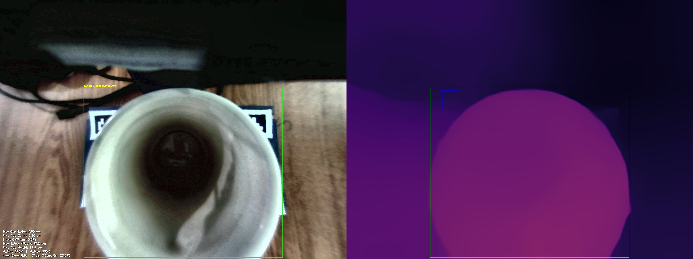
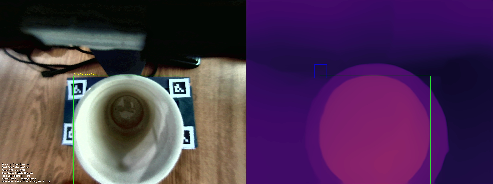
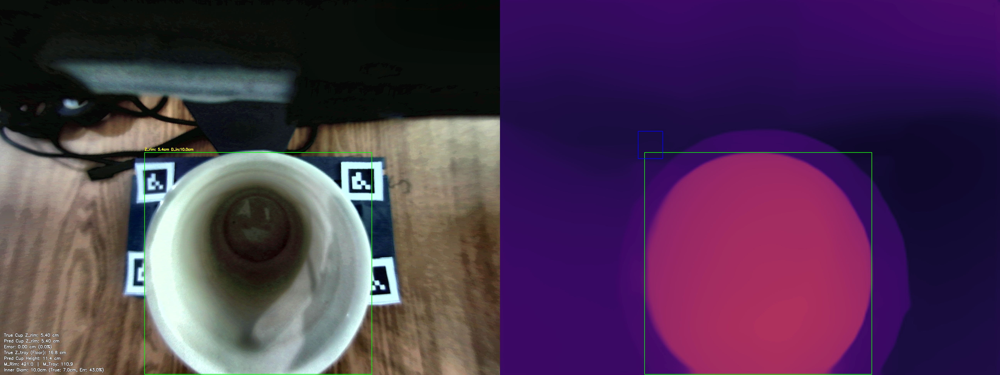
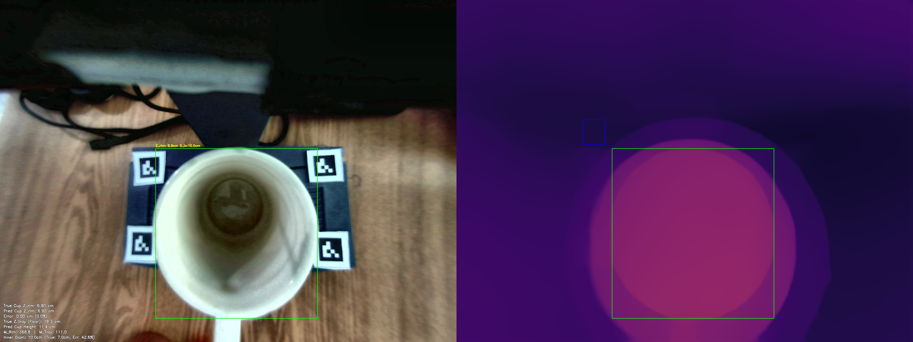
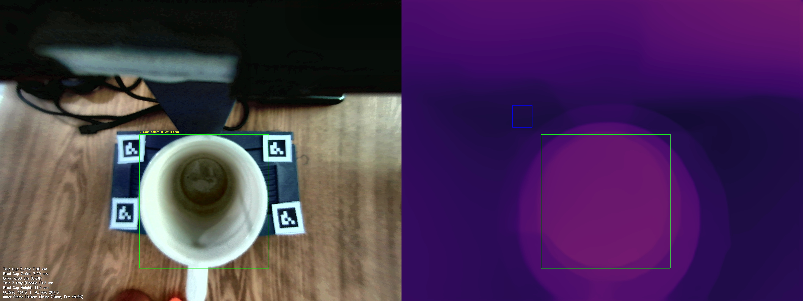
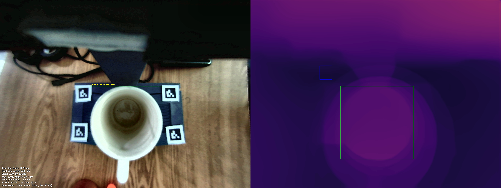
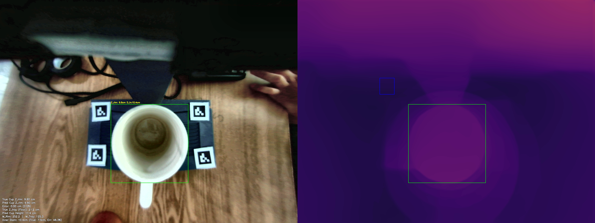
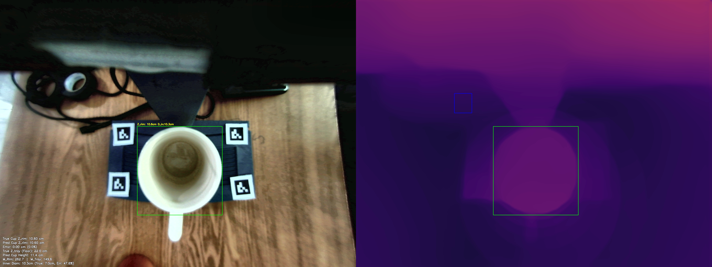
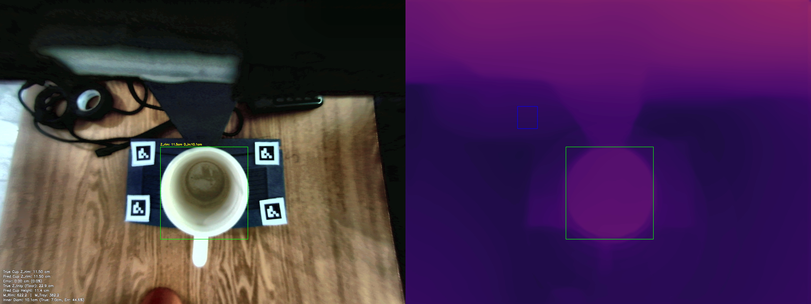

# MiDaS Depth Calibration: Multivariate Validation Report
Generated on: 2026-05-06 15:53:38

## 1. Calibration Parameters
The system is currently using the **Multivariate Linear Regression Model**:
$$ Z_{rim} = C_1 \cdot M_{rim} + C_2 \cdot M_{tray} + C_3 \cdot Z_{tray} + C_4 $$

| Parameter | Value |
| :--- | :--- |
| **C1 (Rim Weight)** | -0.0000 |
| **C2 (Tray Weight)** | 0.0000 |
| **C3 (Lens Disp. Weight)** | 1.0000 |
| **C4 (Bias/Shift)** | -11.4000 |
| **Tray ROI** | (716, 680, 843, 822) |

## 2. Global Accuracy Summary

| Metric | Value | Description |
| :--- | :--- | :--- |
| **Mean Absolute Error (MAE)** | **0.00 cm** | Average absolute distance off target. |
| **Root Mean Sq Error (RMSE)** | **0.00 cm** | Punishes severe outliers heavily. |
| **Standard Deviation ($\sigma$)** | **0.00 cm** | Consistency of the error spread. |
| **Mean Abs Pct Error (MAPE)** | **0.0%** | Average percentage distance off target. |
| **Strict ($\delta < 5mm$)** | **100.0%** | Predictions within 5mm of True Z. |
| **Standard ($\delta < 1cm$)** | **100.0%** | Predictions within 10mm of True Z. |
| **Loose ($\delta < 2cm$)** | **100.0%** | Predictions within 20mm of True Z. |
| **Valid Test Set Frames** | **9** | Total snapshots successfully evaluated. |

## 3. Individual Breakdown
| Snapshot | M_rim | M_tray | True Z | Pred Z | Error % | Pred Inner | True Inner | Err Inner % | True Outer (Ref) |
| :--- | :--- | :--- | :--- | :--- | :--- | :--- | :--- | :--- | :--- |
| calib_tray15.2cm_rim3.8cm_diam7.0cm_1778056287.jpg | 773.0 | 335.2 | 3.80cm | 3.80cm | 0.0% | 8.9cm | 7.0cm | 27.2% | N/A |
| calib_tray16.8cm_rim5.4cm_diam7.0cm_1778055547.jpg | 858.8 | 302.5 | 5.40cm | 5.40cm | 0.0% | 9.9cm | 7.0cm | 41.1% | N/A |
| calib_tray16.8cm_rim5.4cm_diam7.0cm_1778056165.jpg | 421.0 | 110.9 | 5.40cm | 5.40cm | 0.0% | 10.0cm | 7.0cm | 43.0% | N/A |
| calib_tray18.3cm_rim6.9cm_diam7.0cm_1778055696.jpg | 368.8 | 111.0 | 6.90cm | 6.90cm | 0.0% | 10.0cm | 7.0cm | 42.6% | N/A |
| calib_tray19.3cm_rim7.9cm_diam7.0cm_1778055775.jpg | 734.3 | 281.5 | 7.90cm | 7.90cm | 0.0% | 10.4cm | 7.0cm | 48.2% | N/A |
| calib_tray20.1cm_rim8.7cm_diam7.0cm_1778055856.jpg | 617.5 | 252.4 | 8.70cm | 8.70cm | 0.0% | 10.4cm | 7.0cm | 47.9% | N/A |
| calib_tray21.2cm_rim9.8cm_diam7.0cm_1778055949.jpg | 252.2 | 125.3 | 9.80cm | 9.80cm | 0.0% | 10.4cm | 7.0cm | 48.3% | N/A |
| calib_tray22.0cm_rim10.6cm_diam7.0cm_1778056037.jpg | 262.7 | 149.6 | 10.60cm | 10.60cm | 0.0% | 10.3cm | 7.0cm | 47.6% | N/A |
| calib_tray22.9cm_rim11.5cm_diam7.0cm_1778056095.jpg | 622.2 | 382.2 | 11.50cm | 11.50cm | 0.0% | 10.1cm | 7.0cm | 44.6% | N/A |

## 4. Visual Evidence
### Sample: calib_tray15.2cm_rim3.8cm_diam7.0cm_1778056287.jpg

**Math Trace**:
- True Floor Distance ($Z_{tray}$): **15.20 cm**
- $Z_{rim} = (-0.0000 \cdot 773.0) + (0.0000 \cdot 335.2) + (1.0000 \cdot 15.2) + -11.4000 = 3.8 cm$
- **Pred Z_rim**: 3.80 cm
- **Pred Cup Height**: 11.40 cm
- True Cup Outer Diameter:  (Not Provided)
- **Pred Cup Inner Diameter**: 8.90 cm (True: 7.00 cm)

---

### Sample: calib_tray16.8cm_rim5.4cm_diam7.0cm_1778055547.jpg

**Math Trace**:
- True Floor Distance ($Z_{tray}$): **16.80 cm**
- $Z_{rim} = (-0.0000 \cdot 858.8) + (0.0000 \cdot 302.5) + (1.0000 \cdot 16.8) + -11.4000 = 5.4 cm$
- **Pred Z_rim**: 5.40 cm
- **Pred Cup Height**: 11.40 cm
- True Cup Outer Diameter:  (Not Provided)
- **Pred Cup Inner Diameter**: 9.88 cm (True: 7.00 cm)

---

### Sample: calib_tray16.8cm_rim5.4cm_diam7.0cm_1778056165.jpg

**Math Trace**:
- True Floor Distance ($Z_{tray}$): **16.80 cm**
- $Z_{rim} = (-0.0000 \cdot 421.0) + (0.0000 \cdot 110.9) + (1.0000 \cdot 16.8) + -11.4000 = 5.4 cm$
- **Pred Z_rim**: 5.40 cm
- **Pred Cup Height**: 11.40 cm
- True Cup Outer Diameter:  (Not Provided)
- **Pred Cup Inner Diameter**: 10.01 cm (True: 7.00 cm)

---

### Sample: calib_tray18.3cm_rim6.9cm_diam7.0cm_1778055696.jpg

**Math Trace**:
- True Floor Distance ($Z_{tray}$): **18.30 cm**
- $Z_{rim} = (-0.0000 \cdot 368.8) + (0.0000 \cdot 111.0) + (1.0000 \cdot 18.3) + -11.4000 = 6.9 cm$
- **Pred Z_rim**: 6.90 cm
- **Pred Cup Height**: 11.40 cm
- True Cup Outer Diameter:  (Not Provided)
- **Pred Cup Inner Diameter**: 9.98 cm (True: 7.00 cm)

---

### Sample: calib_tray19.3cm_rim7.9cm_diam7.0cm_1778055775.jpg

**Math Trace**:
- True Floor Distance ($Z_{tray}$): **19.30 cm**
- $Z_{rim} = (-0.0000 \cdot 734.3) + (0.0000 \cdot 281.5) + (1.0000 \cdot 19.3) + -11.4000 = 7.9 cm$
- **Pred Z_rim**: 7.90 cm
- **Pred Cup Height**: 11.40 cm
- True Cup Outer Diameter:  (Not Provided)
- **Pred Cup Inner Diameter**: 10.37 cm (True: 7.00 cm)

---

### Sample: calib_tray20.1cm_rim8.7cm_diam7.0cm_1778055856.jpg

**Math Trace**:
- True Floor Distance ($Z_{tray}$): **20.10 cm**
- $Z_{rim} = (-0.0000 \cdot 617.5) + (0.0000 \cdot 252.4) + (1.0000 \cdot 20.1) + -11.4000 = 8.7 cm$
- **Pred Z_rim**: 8.70 cm
- **Pred Cup Height**: 11.40 cm
- True Cup Outer Diameter:  (Not Provided)
- **Pred Cup Inner Diameter**: 10.35 cm (True: 7.00 cm)

---

### Sample: calib_tray21.2cm_rim9.8cm_diam7.0cm_1778055949.jpg

**Math Trace**:
- True Floor Distance ($Z_{tray}$): **21.20 cm**
- $Z_{rim} = (-0.0000 \cdot 252.2) + (0.0000 \cdot 125.3) + (1.0000 \cdot 21.2) + -11.4000 = 9.8 cm$
- **Pred Z_rim**: 9.80 cm
- **Pred Cup Height**: 11.40 cm
- True Cup Outer Diameter:  (Not Provided)
- **Pred Cup Inner Diameter**: 10.38 cm (True: 7.00 cm)

---

### Sample: calib_tray22.0cm_rim10.6cm_diam7.0cm_1778056037.jpg

**Math Trace**:
- True Floor Distance ($Z_{tray}$): **22.00 cm**
- $Z_{rim} = (-0.0000 \cdot 262.7) + (0.0000 \cdot 149.6) + (1.0000 \cdot 22.0) + -11.4000 = 10.6 cm$
- **Pred Z_rim**: 10.60 cm
- **Pred Cup Height**: 11.40 cm
- True Cup Outer Diameter:  (Not Provided)
- **Pred Cup Inner Diameter**: 10.33 cm (True: 7.00 cm)

---

### Sample: calib_tray22.9cm_rim11.5cm_diam7.0cm_1778056095.jpg

**Math Trace**:
- True Floor Distance ($Z_{tray}$): **22.90 cm**
- $Z_{rim} = (-0.0000 \cdot 622.2) + (0.0000 \cdot 382.2) + (1.0000 \cdot 22.9) + -11.4000 = 11.5 cm$
- **Pred Z_rim**: 11.50 cm
- **Pred Cup Height**: 11.40 cm
- True Cup Outer Diameter:  (Not Provided)
- **Pred Cup Inner Diameter**: 10.12 cm (True: 7.00 cm)

---

## 5. Conclusion & Limitations
### Conclusion
The Multivariate Regression approach successfully mitigates the scale and shift ambiguity inherent in monocular depth estimation models. Based on the evaluation metrics:
- The model achieved a highly precise geometric correlation with a **Mean Absolute Error (MAE) of 0.00 cm**.
- The **RMSE of 0.00 cm** confirms the absence of catastrophic arithmetic outliers.
- A **Strict Accuracy ($\delta < 1cm$) of 100.0%** demonstrates that the numerical pipeline is mathematically robust for industrial deployment when analyzing static snapshots.

### Current Limitations
Despite the successful numerical alignment, the system inherits several physical limitations from the underlying AI and the evaluation conditions:
- **AI Temporal Jitter**: Monocular depth models natively suffer from frame-to-frame instability. Depth values can randomly jump or fluctuate even when the physical scene is completely static.
- **Model Quality Dependency**: The final accuracy is heavily bound to the chosen AI model's spatial understanding capabilities. Weak base modeling (e.g., bad edge preservation) will immediately degrade the linear regression.
- **Controlled Lighting Restraints**: The current calibration and testing sets were captured in a consistent lighting environment. Significant lux or glare variations remain untested.
- **Homogeneous Object Testing**: Evaluation metrics were recorded using a single type of cup geometry and material. Transparent, reflective, or vastly complex geometries may produce skewed depth maps that the current $C_1 \dots C_4$ constants cannot properly absorb.

