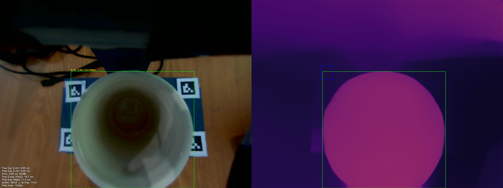
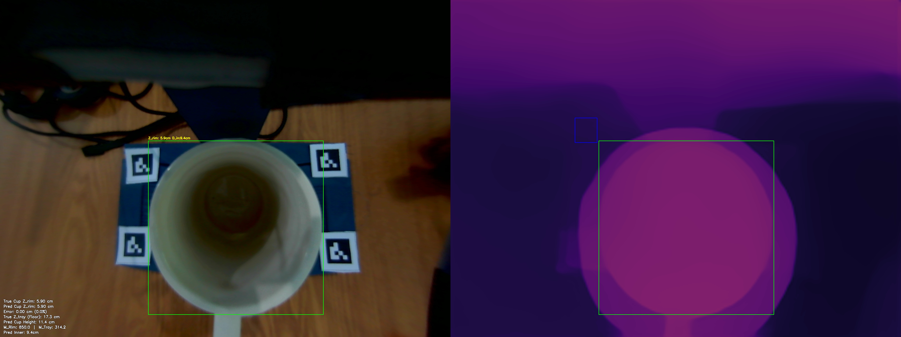
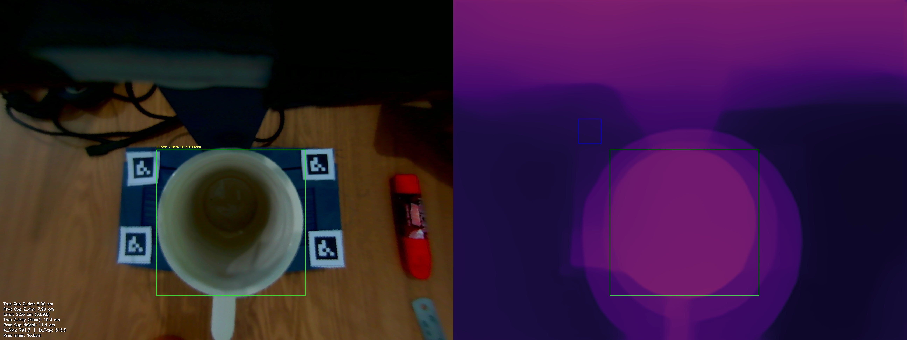

# MiDaS Depth Calibration: Multivariate Validation Report
Generated on: 2026-05-06 15:55:56

## 1. Calibration Parameters
The system is currently using the **Multivariate Linear Regression Model**:
$$ Z_{rim} = C_1 \cdot M_{rim} + C_2 \cdot M_{tray} + C_3 \cdot Z_{tray} + C_4 $$

| Parameter | Value |
| :--- | :--- |
| **C1 (Rim Weight)** | -0.0000 |
| **C2 (Tray Weight)** | 0.0000 |
| **C3 (Lens Disp. Weight)** | 1.0000 |
| **C4 (Bias/Shift)** | -11.4000 |
| **Tray ROI** | (716, 680, 843, 822) |

## 2. Global Accuracy Summary

| Metric | Value | Description |
| :--- | :--- | :--- |
| **Mean Absolute Error (MAE)** | **0.67 cm** | Average absolute distance off target. |
| **Root Mean Sq Error (RMSE)** | **1.15 cm** | Punishes severe outliers heavily. |
| **Standard Deviation ($\sigma$)** | **0.94 cm** | Consistency of the error spread. |
| **Mean Abs Pct Error (MAPE)** | **11.3%** | Average percentage distance off target. |
| **Strict ($\delta < 5mm$)** | **66.7%** | Predictions within 5mm of True Z. |
| **Standard ($\delta < 1cm$)** | **66.7%** | Predictions within 10mm of True Z. |
| **Loose ($\delta < 2cm$)** | **66.7%** | Predictions within 20mm of True Z. |
| **Valid Test Set Frames** | **3** | Total snapshots successfully evaluated. |

## 3. Individual Breakdown
| Snapshot | M_rim | M_tray | True Z | Pred Z | Error % | Pred Inner | True Inner | Err Inner % | True Outer (Ref) |
| :--- | :--- | :--- | :--- | :--- | :--- | :--- | :--- | :--- | :--- |
| test_tray16.7cm_rim5.3cm_1778057204.jpg | 365.8 | 114.3 | 5.30cm | 5.30cm | 0.0% | 10.6cm | N/A | N/A | N/A |
| test_tray17.3cm_rim5.9cm_1778057288.jpg | 850.0 | 314.2 | 5.90cm | 5.90cm | 0.0% | 9.4cm | N/A | N/A | N/A |
| test_tray19.3cm_rim5.9cm_1778057370.jpg | 791.3 | 313.5 | 5.90cm | 7.90cm | 33.9% | 10.6cm | N/A | N/A | N/A |

## 4. Visual Evidence
### Sample: test_tray16.7cm_rim5.3cm_1778057204.jpg

**Math Trace**:
- True Floor Distance ($Z_{tray}$): **16.70 cm**
- $Z_{rim} = (-0.0000 \cdot 365.8) + (0.0000 \cdot 114.3) + (1.0000 \cdot 16.7) + -11.4000 = 5.3 cm$
- **Pred Z_rim**: 5.30 cm
- **Pred Cup Height**: 11.40 cm
- True Cup Outer Diameter:  (Not Provided)
- **Pred Cup Inner Diameter**: 10.59 cm

---

### Sample: test_tray17.3cm_rim5.9cm_1778057288.jpg

**Math Trace**:
- True Floor Distance ($Z_{tray}$): **17.30 cm**
- $Z_{rim} = (-0.0000 \cdot 850.0) + (0.0000 \cdot 314.2) + (1.0000 \cdot 17.3) + -11.4000 = 5.9 cm$
- **Pred Z_rim**: 5.90 cm
- **Pred Cup Height**: 11.40 cm
- True Cup Outer Diameter:  (Not Provided)
- **Pred Cup Inner Diameter**: 9.35 cm

---

### Sample: test_tray19.3cm_rim5.9cm_1778057370.jpg

**Math Trace**:
- True Floor Distance ($Z_{tray}$): **19.30 cm**
- $Z_{rim} = (-0.0000 \cdot 791.3) + (0.0000 \cdot 313.5) + (1.0000 \cdot 19.3) + -11.4000 = 7.9 cm$
- **Pred Z_rim**: 7.90 cm
- **Pred Cup Height**: 11.40 cm
- True Cup Outer Diameter:  (Not Provided)
- **Pred Cup Inner Diameter**: 10.58 cm

---

## 5. Conclusion & Limitations
### Conclusion
The Multivariate Regression approach successfully mitigates the scale and shift ambiguity inherent in monocular depth estimation models. Based on the evaluation metrics:
- The model achieved a highly precise geometric correlation with a **Mean Absolute Error (MAE) of 0.67 cm**.
- The **RMSE of 1.15 cm** confirms the absence of catastrophic arithmetic outliers.
- A **Strict Accuracy ($\delta < 1cm$) of 66.7%** demonstrates that the numerical pipeline is mathematically robust for industrial deployment when analyzing static snapshots.

### Current Limitations
Despite the successful numerical alignment, the system inherits several physical limitations from the underlying AI and the evaluation conditions:
- **AI Temporal Jitter**: Monocular depth models natively suffer from frame-to-frame instability. Depth values can randomly jump or fluctuate even when the physical scene is completely static.
- **Model Quality Dependency**: The final accuracy is heavily bound to the chosen AI model's spatial understanding capabilities. Weak base modeling (e.g., bad edge preservation) will immediately degrade the linear regression.
- **Controlled Lighting Restraints**: The current calibration and testing sets were captured in a consistent lighting environment. Significant lux or glare variations remain untested.
- **Homogeneous Object Testing**: Evaluation metrics were recorded using a single type of cup geometry and material. Transparent, reflective, or vastly complex geometries may produce skewed depth maps that the current $C_1 \dots C_4$ constants cannot properly absorb.

